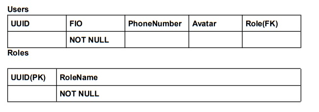
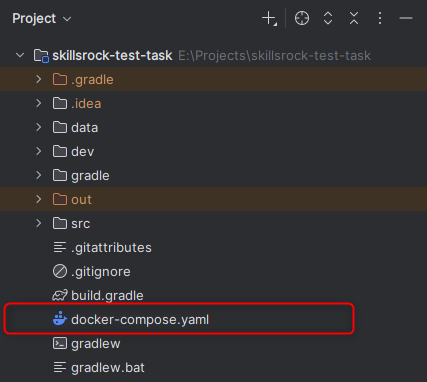
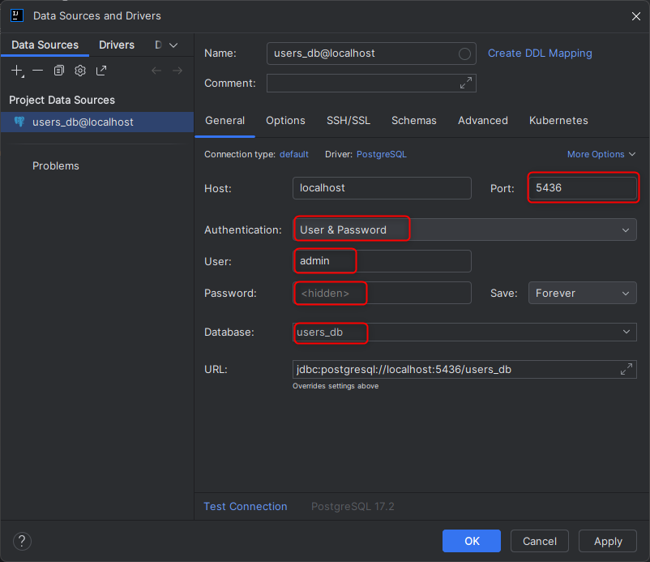

# Skillsrock test task

## Project objective ##

Need to write a REST API application that provides 
information about the user.

### Application functional: ###

- Adding a new *user* with the fields: *FIO, phone number,
  avatar* and *role*.
- Get user data.
- Update user data, i.e. change its main fields: *FIO, phone number,
  avatar* and *role*.
- Delete *user* by *UUID*. The *role* must also be deleted

### Technology stack: ###

- Java 17
- Spring Boot 3
- PostgreSQL

### Tables scheme:

### API endpoints:

- *POST:* /api/createNewUser (JSON BODY)
- *GET:* /api/users?userID=anyUUID
- *PUT:* /api/userDetailsUpdate (JSON BODY или Params)
- *DELETE:* /api/users?userID=anyUUID

### Requirements:

- readable and structured code
- validation of incoming data
- SOLID, MVC

### Will be a plus:

- error handling via @ControllerAdvice
- adding caching
- using docker
- migrations from Liquibase

## Let's start

1. Docker is used to work with the project. To up the database, 
***docker-compose.yaml*** is used, which is located in the root 
of the project.

2. Using a docker file, you need to up a container with a database and 
connect using the credentials specified in the file

3. After connecting to the database, I used the *Flyway* plugin to create a 
migration for the database. This is how I created the tables described in the 
task, taking into account the constraints, primaries and foreign keys. 

4. *Flyway* is quick to set up and easily creates migrations for a database. The 
generated SQL files for the selected database describe the creation of tables 
with fields, constraints and keys.

5. But now all the necessary data is already there. Therefore, after 
connecting to the database and starting the application, the migrations will 
be loaded automatically, and you will immediately be able to work with data 
in the database

## How it works

1. To interact with the database I used Postman, with which I worked with data
on the endpoints specified earlier in the task. By specifying the HTTP method 
and parameters in the endpoint, I manipulate the data in the database.
For example, I register a new user.

2. The request was successful, code 200 was returned. If you access the 
database, you can see that the new user has been saved

3. For other queries we can also take data such as *UUID* from the 
database and use it to *get* data, *put* or *delete*.

## My tech stack:

- Java 17
- Spring Boot 3
- PostgreSQL
- Docker
- Postman
- Flyway

