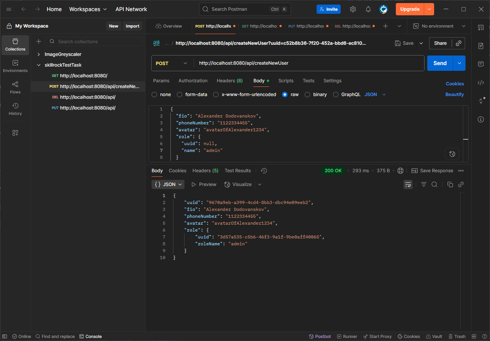
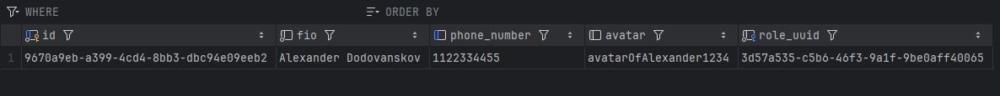

# Skillsrock test task

REST API application that provides information about the user.
See details in the document:

[task_file](src/main/resources/readme_content/task.pdf)

### Technology stack: ###

- Java 17
- Spring Boot 3
- PostgreSQL
- Docker
- Postman
- Flyway

## How to run and how to create migrations via Flyway:

## How to run and how to create migrations via Flyway:

1. First of all run PostgreSQL docker container with
   ```docker-compose up```
2. The next step is to run the Spring Boot application.

3. If you want to create migrations in easy way, install *Flyway* plugin (see the screenshot below).


4. Then just create versioned migration via option below:


As a result you will create a migration file (see ex. below):


## How it works (just a small example)


1. Let's consider the POST request. You need to set URL and JSON request body.



2. If the request was successful, you will see the new user and role saved in the database.




3. For other requests we can also take data such as *UUID* from a
   database/or response body (from POST request) and use it to *get*/*put*/*delete* data.


